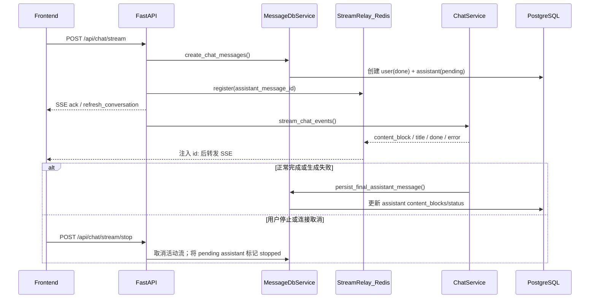

# 会话管理（当前实现）

本文档描述当前仓库中的会话、消息与聊天流式协议。实现入口主要位于：

- 后端：`backend/app/api/conversation.py`、`backend/app/api/chat.py`、`backend/app/api/message.py`
- 流式协议：`backend/app/protocols/chat_messages.py`、`backend/app/services/chat/stream_relay.py`
- 前端消费：`frontend/src/services/chat.ts`、`frontend/src/hooks/chat.ts`

## 1. 关键接口

### 会话

- 创建会话：`POST /api/conversation/register`
- 会话列表：`GET /api/conversation/list?limit=20&cursor=<opaque>`
- 会话详情：`GET /api/conversation/detail/{conversation_id}`
- 会话消息：`GET /api/conversation/{conversation_id}/messages`
- 更新标题：`PUT /api/conversation/update/{conversation_id}`
- 删除会话：`DELETE /api/conversation/delete/{conversation_id}`

会话列表使用 keyset 游标分页。首页不传 `cursor`；后续请求原样回传上一页的
`next_cursor`。`limit` 默认为 20，范围为 1–100：

```json
{
  "conversations": [],
  "next_cursor": "AZ0...",
  "has_more": true,
  "limit": 20
}
```

排序键为 `(last_message_created_at DESC, id DESC)`。游标是服务端生成的 URL-safe
Base64 不透明值，客户端不应解析或自行构造；非空但无法解码的游标返回 HTTP 400。
该接口不支持页码跳转。

### 消息

- 删除消息：`DELETE /api/message/delete/{message_id}`
- 更新助手消息反馈：`PUT /api/message/feedback/{message_id}`

反馈接口仅允许更新当前用户会话中的助手消息。`value` 支持 `default`、`like`、
`dislike`；`reasons` 是多选理由标签，`comment` 是可选自由文本：

```json
{
  "value": "dislike",
  "reasons": ["回答不准确", "没有解决问题"],
  "comment": "引用的版本已经过期"
}
```

更新 `like` 或 `dislike` 时，省略 `reasons` 或 `comment` 会保留该字段的已有值；
传入空数组可清空理由。`comment` 当前无法通过 `null` 单独清空，因为 `null` 与
省略都表示保留已有值。传入 `value=default` 会同时清空理由和评论。

成功响应的 `data` 包含服务端写入的 `updated_at`：

```json
{
  "value": "dislike",
  "updated_at": "2026-07-18T12:00:00+08:00",
  "reasons": ["回答不准确", "没有解决问题"],
  "comment": "引用的版本已经过期"
}
```

### 聊天

- 流式对话：`POST /api/chat/stream`
- 断线续流：`POST /api/chat/stream/resume`
- 停止流式对话：`POST /api/chat/stream/stop`
- 模型列表：`GET /api/chat/models`

`POST /api/chat/stream` 会先创建用户消息与助手占位消息，再通过 SSE 返回生成过程。若请求中包含图片块，后端会校验所选模型的 `image_support`，不支持图片输入时返回 `400 当前模型不支持图片输入`。

## 2. 消息内容模型

当前 `messages` 表不再使用旧的 `content` / `reasoning` / `tool_calls` 独立列保存主体内容，消息正文统一在 `content_blocks` JSON 字段中表示。常见块类型包括：

- 用户侧：`text`、`image`、`pdf`、`markdown`
- 助手侧：`text`、`thinking`、`tool_use`、`tool_result`

运行时状态字段：

- `status`：`pending | stopped | done | failed`
- `reply_to`：助手消息关联的用户消息 ID
- `message_metadata`：请求配置、回复关系等元数据
- `feedback`：助手消息反馈，包含 `value`、`updated_at`、`reasons` 和 `comment`

附件块可携带可选 `token_size`（上传时按 embedding tokenizer 计算；历史数据可能缺省）。`agent_mode=0` 时，问答仅处理**当前轮**附件：短文档注入全文，长文档在问答阶段按需 embedding 后做 RAG；不再扫描 `history_ids` 中的历史附件。

## 3. 流式协议（SSE）

后端统一通过 `data:` 行发送 JSON，不使用 `event:` 行。客户端应解析 `data` 中的 `type` 字段分发事件。每条 SSE 帧还会带标准 `id:` 行（1-based 整数），用于断点续传：

```text
id: 1
data: {"type":"ack","data":{...}}

id: 4
data: {"type":"content_block","data":{"op":"append","block":{...}}}
```

`id` 由 Redis 版 `StreamRelay` 在写入 Redis Stream 时分配，客户端通过请求头 `Last-Event-ID` 回传游标。前端会把服务端的 snake_case 字段转换为 camelCase。

### 3.1 事件类型

| 类型 | 说明 |
|------|------|
| `ack` | 用户消息或助手占位消息已创建，`data` 为消息对象 |
| `refresh_conversation` | 会话列表中的会话信息需要刷新 |
| `title` | 后端生成会话标题，通常由 `regenerate_title=true` 触发 |
| `content_block` | 内容块增量，承载正文、思考、工具调用和工具结果 |
| `done` | 本轮生成完成，助手消息已持久化 |
| `error` | 本轮生成失败 |

历史文档中的 `mcp_tool_call`、`reasoning`、`content` 顶层事件已不是现网协议；这些信息现在通过 `content_block.data` 表达。

### 3.2 `content_block` 增量

`content_block.data.op` 支持：

- `append`：追加一个完整内容块，例如 `text`、`thinking`、`tool_use`、`tool_result`
- `delta`：向指定块追加文本增量
- `tool_delta`：向指定 `tool_use` 块追加工具参数增量
- `finalize_round`：一轮工具/模型交互结束
- `done`：内容块流结束

前端类型定义见 `frontend/src/interfaces/contentBlock.ts`。

### 3.3 `done` 与 `error`

后端 `done.data` 原始字段：

- `content_length`
- `reasoning_length`
- `tool_calls_length`
- `updated_at`

前端解析后会转换为 `contentLength`、`reasoningLength`、`toolCallsLength`、`updatedAt` 等 camelCase 字段。

`error.data` 至少包含：

- `content`：错误信息
- `conversation_id`：生成阶段异常时会携带

## 4. 断线续流

### 4.1 请求

```http
POST /api/chat/stream/resume
Last-Event-ID: 12
Content-Type: application/json
Last-Event-ID: 12

{
  "assistant_message_id": "assistant-message-id"
}
```

`Last-Event-ID` 为客户端最近成功消费的 SSE `seq`；请求体只包含要续流的 `assistant_message_id`。

后端会校验：

1. `assistant_message_id` 对应消息存在且角色为 `assistant`
2. 该消息所属会话属于当前登录用户
3. Redis 中仍存在该助手消息对应的流缓冲（TTL 内）

### 4.2 Redis 数据模型

| Key | 类型 | 用途 |
|-----|------|------|
| `chat:sse:stream:{assistant_message_id}` | Stream | SSE 事件 payload |
| `chat:sse:meta:{assistant_message_id}` | Hash | `status`（`pending` / `stopped` / `done` / `failed`）/ `created_at` / `last_event_id` |
| `chat:sse:seq:{assistant_message_id}` | String | event_id 单调递增计数器（INCR） |
| `chat:turn:{user_id}:{conversation_id}:{client_turn_id}` | String | turn 幂等记录（JSON 或 `pending`） |

### 4.3 边界

- 续流缓冲存储在 **Redis Stream**，可跨 worker / 进程共享（需 Redis 可达）。
- **不设条数上限**；整 key 靠 TTL 过期删除（活跃默认 2h，`close` 后默认 30min）。
- meta `status` 与 DB `MessageStatus` 语义对齐：`pending` 可写入；`stopped` / `done` / `failed` 为终态，不再 append。
- 生成完成后流标记 `done`（或失败时 `failed`），TTL 缩短；过期后续流接口返回空 SSE。
- 用户 stop 时任意 worker 将 meta 设为 `status=stopped`；持有 producer 的 worker 轮询到后取消任务。同 worker 仍有本地 task cancel 快路径。
- 前端从历史消息恢复时无法得知精确 `Last-Event-ID`，会从 `0` 开始尝试续传仍在活动中的助手流。
- `client_turn_id` 幂等缓存也在 Redis，相同 turn 的重试不会重复创建用户/助手消息。

## 5. 消息保存与流式返回



正常完成时，助手消息以 `done` 写入；生成失败时以 `failed` 写入。用户主动停止或连接取消时，助手消息可能以 `stopped` 持久化；取消发生在生成协程内时，后端会先同步已聚合的 `content_blocks` 再更新消息，避免已生成的文本、思考或工具块丢失。

## 6. 标题生成流程

- 触发条件：`POST /api/chat/stream` 且 `regenerate_title=true`
- 返回事件：`title`
- 也可由前端调用 `PUT /api/conversation/update/{conversation_id}` 手动修改

## 7. 常见坑

- 鉴权：会话、消息、聊天与模型列表接口都需要 JWT（`Authorization: Bearer <token>`）。
- `GET /api/conversation/{conversation_id}/messages` 在 `detail` 路由之前注册，路径不要写成旧的 `/conversations`。
- SSE 客户端不要按 `event:` 分发事件，应从 `data` JSON 的 `type` 字段分发；续传游标使用 SSE `id:` / `Last-Event-ID`。
- 续流接口路径是 `/api/chat/stream/resume`，不是 `/api/chat/resume`。
- 多 worker 部署时必须保证 Redis 可达，否则 SSE 缓冲与 turn 幂等不可用。
- 会话列表的 `cursor` 是不透明游标，不要缓存后自行改写，也不要继续发送旧的
  `offset` 参数。
- 反馈增量更新中，省略 `reasons` / `comment` 表示保留旧值；`value=default`
  才会同时清空两个字段。
- 助手消息在生成中为 `pending`；`done` 表示完整生成已写入，`stopped` 表示用户停止或连接取消后已尽力保存当前已聚合内容。
- `stop` 通过 Redis meta `status=stopped` 跨 worker 生效；同 worker 仍走本地 producer task cancel。DB 落库由 orchestrator 的 `CancelledError` 收尾（含部分 `content_blocks`），stop 端点仅在仍为 `pending` 时做兜底。
