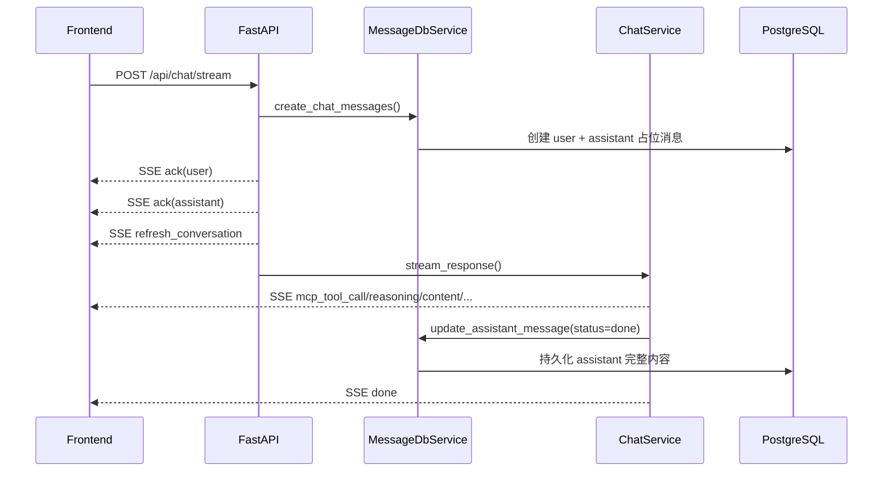

# 会话管理（当前实现）

## 1. 关键接口

- 创建会话：`POST /api/conversation/register`
- 会话列表：`GET /api/conversation/list`
- 会话详情：`GET /api/conversation/detail/{conversation_id}`
- 会话消息：`GET /api/conversation/{conversation_id}/messages`
- 更新标题：`PUT /api/conversation/update/{conversation_id}`
- 删除会话：`DELETE /api/conversation/delete/{conversation_id}`
- 删除消息：`DELETE /api/message/delete/{message_id}`
- 流式对话：`POST /api/chat/stream`

## 2. 流式协议（SSE）约定

后端统一通过 `data:` 行返回 JSON，不使用 `event:` 行：

```text
data: {"type":"ack","data":{...}}

data: {"type":"reasoning","data":{"status":"start","content":"..."}}
```

### 2.1 事件类型

按一次典型请求的时序，常见事件如下：

1. `ack`（通常 2 条：user + assistant 占位消息）
2. `refresh_conversation`（刷新会话列表中的会话信息）
3. `mcp_tool_call`（0~N 条，最后可能有 `{status: "done"}`）
4. `reasoning`（可选，`status`: `start | continue | done`）
5. `content`（`status`: `start | continue | done`）
6. `title`（可选，`regenerate_title=true` 时由后端生成）
7. `done`
8. `error`（异常路径）

> 注意：当前实现中工具事件名是 `mcp_tool_call`，不是 `tool_call`。

### 2.2 `done` 与 `error` 负载（后端口径）

- `done.data`：
  - `content_length`
  - `reasoning_length`
  - `tool_calls_length`
  - `updated_at`
- `error.data`：
  - `content`
  - `conversation_id`（在 `stream_response` 异常路径中返回）

## 3. 消息保存与流式返回



## 4. 标题生成流程

- 触发条件：`POST /api/chat/stream` 且 `regenerate_title=true`
- 返回事件：`title`
- 也可由前端调用 `PUT /api/conversation/update/{conversation_id}` 手动修改

## 5. 边界与常见坑

- 鉴权：会话和消息接口需要 JWT（`Authorization: Bearer <token>`）。
- 当前仅支持 `POST /api/chat/stream`，不存在 `/api/chat/resume`。
- 历史文档中的 `/conversations` 路径、`tool_call` 事件名均非现网口径。
- 若客户端按 `event:` 分发 SSE，会收不到事件；应从 `data` JSON 的 `type` 字段分发。
