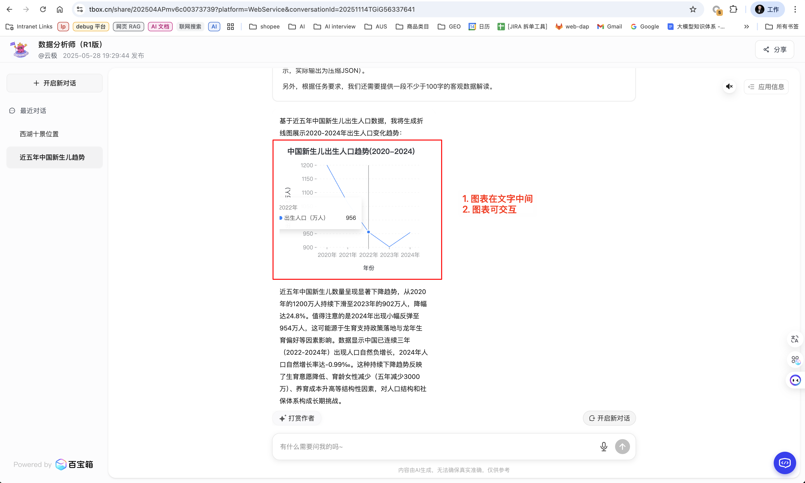

## 图表可视化展示
模型生成答案时，如何在内容中间插入图表可视化展示。

效果示例：https://www.tbox.cn/share/202504APmv6c00373739?platform=WebService&conversationId=20251114TGiG56337641

### 实现分析
1. 图表的数据应该是嵌入在 content 内容中，以 code 块的形式存在
2. 当识别到图表类型的 code 块时，需要将 code 块中的数据提取出来，并使用 echarts 进行可视化展示

### 问题
1. 图表组件的定义是否作为 tool 定义传入模型 tools 参数列表
2. 工具调用阶段，提示词中是否需要强调图表生成的需求
3. 最终生成答案时，如何提示模型对于图表类的工具回复，需要原样返回工具的定义格式
