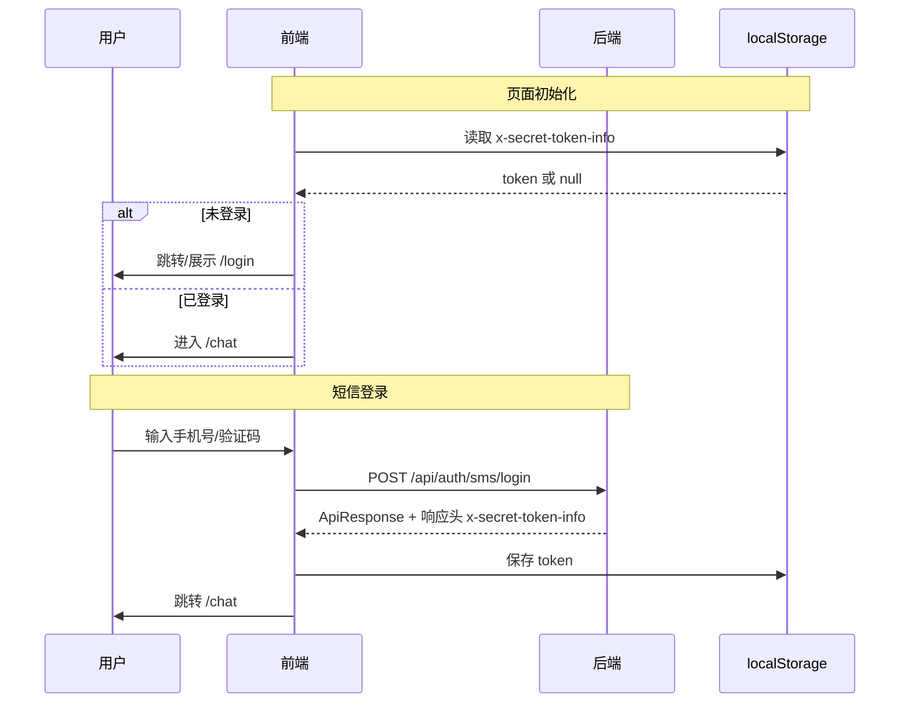
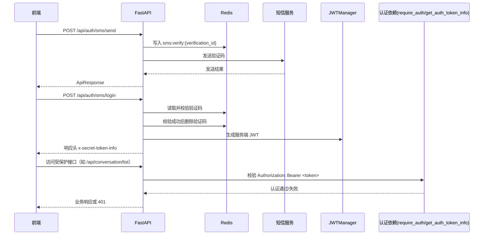

# 认证流程（当前实现）

本文档描述当前仓库中的认证实现：短信验证码登录、微信登录、JWT 鉴权。

## 1. 关键接口

认证接口统一挂在 `/api/auth`：

- `POST /api/auth/sms/send`：发送短信验证码
- `POST /api/auth/sms/login`：短信验证码登录
- `POST /api/auth/wechat/init`：微信登录初始化
- `POST /api/auth/wechat/login`：微信登录回调处理
- `POST /api/auth/logout`：退出登录

## 2. 前端认证流程

## 3. 后端认证流程

### 3.1 短信验证码存储与失败语义

短信验证码由后端生成并存入 Redis，不再依赖 Cloudbase 完成验证码校验：

- Redis key：`sms:verify:{verification_id}`；
- 存储内容：`{"code": "...", "phone": "..."}`；
- TTL：300 秒，响应体中的 `expires_in` 与该 TTL 保持一致；
- 成功发送短信前会先写 Redis；腾讯云短信发送失败时会尝试删除该验证码，避免前端拿到不可用的 `verification_id`；
- Redis 写入或读取失败时，短信发送/登录接口返回 `503`，错误信息为 `验证码服务暂不可用`；
- 验证码过期或 `verification_id` 不存在时返回 `400`：`验证码已过期或无效`；
- 验证码错误或手机号不匹配时返回 `400`，且验证码不会被删除，用户可在 TTL 内重试；
- 校验成功后删除 Redis key，并通过 `UserDbService.get_or_create_user_by_phone()` 创建或更新短信用户。

运行约束：

- 应用启动时会初始化 Redis 连接池并执行 `PING`；Redis 不可达会导致启动失败；
- `/api/health` 返回 `{"status": "healthy", "redis": "ok" | "unavailable"}`，用于运行期探测已启动进程的 Redis 连通性；
- 本地或部署环境可通过 `REDIS__HOST`、`REDIS__PORT`、`REDIS__USERNAME`、`REDIS__PASSWORD` 覆盖配置（`__` 为 Pydantic Settings 的嵌套分隔符）。

## 4. 请求鉴权约定

- 前端请求受保护接口时，需携带：
  - `Authorization: Bearer <x-secret-token-info>`
- 后端通过依赖注入完成认证：
  - `require_auth`：仅校验通过与否
  - `get_auth_token_info`：校验并提取用户信息（如 `user_id`）
- 当返回 `401` 时，前端应清理本地 token 并跳转登录页。

## 5. 与旧文档的差异说明

- 当前实现中不再使用 Cloudbase 作为认证主流程描述；
- 文档中的业务接口统一采用 `/api/*` 前缀；
- 会话相关接口应使用 `/api/conversation/*`，而不是 `/conversations`。
