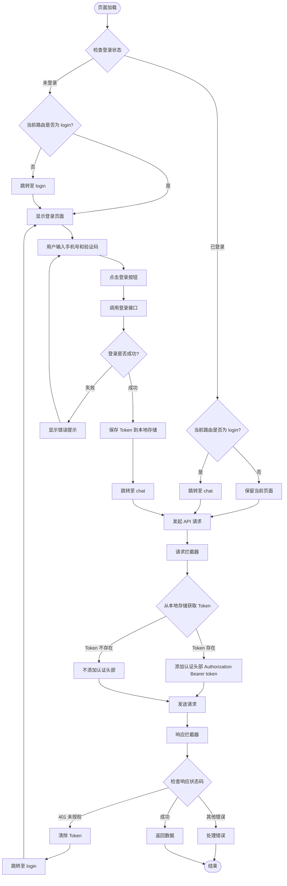

# 认证流程

## 前端流程图

### 流程说明

#### 1. 页面加载时的认证检查
- **未登录状态**：
  - 如果当前在 `/login` 页面，直接显示登录页面
  - 如果不在 `/login` 页面，跳转至 `/login` 页面
  
- **已登录状态**：
  - 如果当前在 `/login` 页面，跳转回 `/chat` 页面
  - 如果不在 `/login` 页面，保留当前页面，继续正常流程

#### 2. 登录流程
- 用户在登录页面输入手机号和验证码
- 点击登录按钮后调用登录接口
- 登录成功后：
  - 保存 Token 到本地存储（localStorage 或 sessionStorage）
  - 跳转至 `/chat` 页面
- 登录失败则显示错误提示，用户可以重新输入

#### 3. 请求认证头部
- 每次发起 API 请求时，通过请求拦截器处理
- 从本地存储获取 Token
- 如果 Token 存在，在请求头中添加 `Authorization: Bearer {token}`
- 如果 Token 不存在，不添加认证头部（允许公开接口）

#### 4. 响应处理
- 通过响应拦截器检查响应状态码
- 如果返回 401（未授权），说明 Token 已过期或无效：
  - 清除本地存储的 Token
  - 跳转至 `/login` 页面重新登录
- 其他错误正常处理，成功则返回数据

## 后端流程图