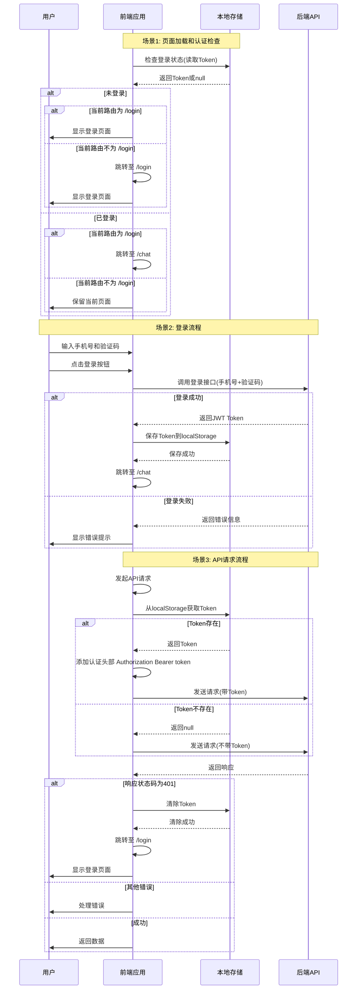
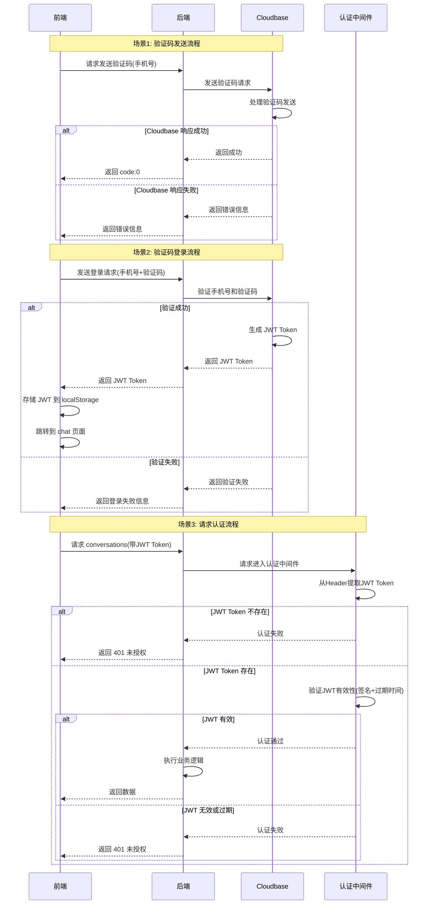

# 认证流程

## 前端流程图

### 流程说明

#### 1. 页面加载时的认证检查
- **未登录状态**：
  - 如果当前在 `/login` 页面，直接显示登录页面
  - 如果不在 `/login` 页面，跳转至 `/login` 页面
  
- **已登录状态**：
  - 如果当前在 `/login` 页面，跳转回 `/chat` 页面
  - 如果不在 `/login` 页面，保留当前页面，继续正常流程

#### 2. 登录流程
- 用户在登录页面输入手机号和验证码
- 点击登录按钮后调用登录接口
- 登录成功后：
  - 保存 Token 到本地存储（localStorage 或 sessionStorage）
  - 跳转至 `/chat` 页面
- 登录失败则显示错误提示，用户可以重新输入

#### 3. 请求认证头部
- 每次发起 API 请求时，通过请求拦截器处理
- 从本地存储获取 Token
- 如果 Token 存在，在请求头中添加 `Authorization: Bearer {token}`
- 如果 Token 不存在，不添加认证头部（允许公开接口）

#### 4. 响应处理
- 通过响应拦截器检查响应状态码
- 如果返回 401（未授权），说明 Token 已过期或无效：
  - 清除本地存储的 Token
  - 跳转至 `/login` 页面重新登录
- 其他错误正常处理，成功则返回数据

## 后端流程图

### 流程说明

#### 1. 验证码发送流程
- 前端发起验证码发送请求
- 后端接收请求后，向 Cloudbase 发送验证码发送请求
- Cloudbase 处理完成后，后端返回 `code:0` 表示成功，或返回错误信息

#### 2. 验证码登录流程
- 前端发送手机号和验证码到后端
- 后端向 Cloudbase 验证手机号和验证码是否正确
- 如果验证失败，后端返回错误信息给前端
- 如果验证成功：
  - Cloudbase 生成 JWT 认证 Token
  - 后端将 JWT Token 返回给前端
  - 前端收到 JWT 后，存储到 `localStorage`
  - 前端自动跳转到 `/chat` 页面

#### 3. 请求认证流程
- 前端在 `/chat` 页面发起 `/conversations` 等业务请求
- 请求头中包含 `Authorization: Bearer {JWT}`
- 后端接收请求后，通过认证中间件处理：
  - 从请求头中提取 JWT Token
  - 检查 JWT 是否存在
  - 如果不存在，直接返回 401 未授权
  - 如果存在，验证 JWT 的有效性（签名、过期时间等）
  - 如果 JWT 无效或已过期，返回 401 未授权
  - 如果 JWT 有效，继续执行业务逻辑并返回数据

#### 4. 认证中间件职责
- **JWT 提取**：从 `Authorization` 请求头中提取 Bearer Token
- **JWT 验证**：验证 Token 的签名、过期时间等
- **权限控制**：根据验证结果决定是否允许访问业务接口
- **错误处理**：统一处理认证失败的情况，返回标准的 401 响应
