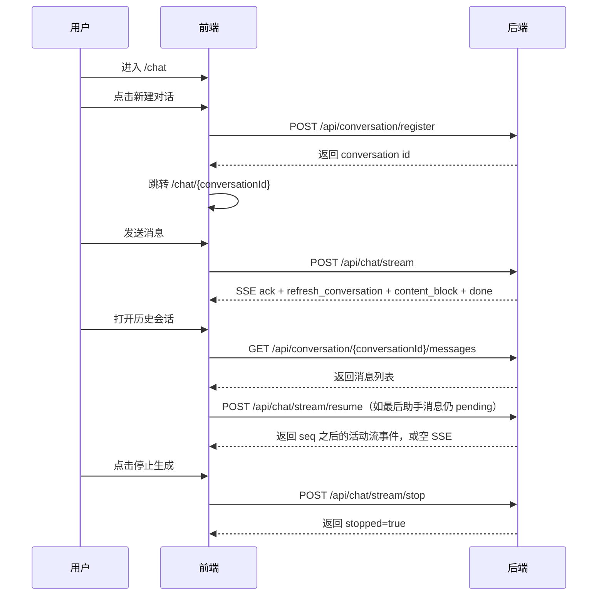

# AI 助手会话交互说明（当前实现）

本文档描述前端会话相关的路由、状态与接口对接，按当前 `frontend/src` 与后端 `/api/conversation/*`、`/api/chat/*` 实现整理。

## 1. 路由

当前前端路由：

- `/`：重定向到 `/chat`
- `/chat`：欢迎页（空聊天页）
- `/chat/:conversationId`：具体会话页
- `/login`、`/login/wechat/callback`：登录相关页面
- `/markdown`：Markdown 示例页

## 2. 会话接口映射

前端在 `src/services/conversation.ts` 中统一调用以下接口（通过 `apiClient`，最终前缀为 `/api`）：

- 创建会话：`POST /api/conversation/register`
- 激活草稿：`PUT /api/conversation/activate/{conversationId}`
- 会话列表：`GET /api/conversation/list`
- 会话搜索：`GET /api/conversation/search`
- 会话详情：`GET /api/conversation/detail/{conversationId}`
- 更新会话：`PUT /api/conversation/update/{conversationId}`
- 删除会话：`DELETE /api/conversation/delete/{conversationId}`
- 手动压缩：`POST /api/conversation/{conversationId}/compress`（前端超时 120s）

消息与流式接口在 `src/services/chat.ts`：

- 会话消息：`GET /api/conversation/{conversationId}/messages`（不传 `full_content`，走后端默认省略结构化 tool_result 正文）
- 删除消息：`DELETE /api/message/delete/{messageId}`
- 更新助手消息反馈：`PUT /api/message/feedback/{messageId}`
- 流式聊天：`POST /api/chat/stream`（SSE）
- 断线续流：`POST /api/chat/stream/resume`（SSE）
- 停止流式聊天：`POST /api/chat/stream/stop`
- 模型列表：`GET /api/chat/models`

### 2.1 会话列表分页

`conversationAPI.getConversations()` 接受 `limit` 和不透明的 `cursor`。首页不传
`cursor`，后续请求传上一页响应的 `nextCursor`：

```ts
const firstPage = await conversationAPI.getConversations({ limit: 20 });
const nextPage = await conversationAPI.getConversations({
  limit: firstPage.limit,
  cursor: firstPage.nextCursor,
});
```

后端响应的 `next_cursor`、`has_more` 会由 `apiClient` 转成 `nextCursor`、
`hasMore`。`loadConversations` 在无 cursor 时替换 Redux 列表，在有 cursor 时
追加并按会话 ID 去重；侧栏通过 `useConversationInfiniteScroll` 在
`hasMore=true` 时继续加载。游标由后端生成，前端不得解析、修改或替换为旧的
`offset` 参数。

### 2.2 会话搜索（侧栏 / ⌘K）

UI：`SearchModal`（`src/components/Layout/modals/SearchModal.tsx`）。入口在侧栏搜索按钮；快捷键 ⌘K（macOS）/ Ctrl+K（其它），在 `MainLayout` 注册。

```ts
await conversationAPI.searchConversations({
  q: keyword,
  limit: 20,
  cursor: nextCursor ?? undefined,
});
```

行为约定：

- 输入防抖 500ms；每页 `limit=20`，无限滚动用 `nextCursor` / `hasMore`
- 本地搜索历史：`localStorage` 键 `conversation-search-history:v1`，最多 20 条（仅首页结果写入，避免翻页重复）
- 结果展示 `matchType`（`title` / `user` / `assistant`）与 `snippet`；点击跳转对应会话
- 前端只传 `q` / `limit` / `cursor`。生产正文是 zhparser 全文检索，不是 JSON ILIKE；标题仍是子串。契约与索引见 `docs/会话管理.md`、`docs/CONVERSATION_SEARCH_OPTIMIZATION.md`

后端契约见 `docs/会话管理.md`「会话搜索」。

### 2.3 草稿会话

欢迎页 `useDraftConversation`：用户先上传附件时 `registerConversation({ isActive: false })`，避免空会话进侧栏；发送首条消息时 `activateConversation` 再跳转 `/chat/:id`。无草稿则直接 `registerConversation({ isActive: true })`。列表/搜索只返回 `is_active=true`。

### 2.4 会话压缩

侧栏菜单确认后 `dispatch(compressConversation(id))`。成功弹出 `CompressResultModal`，展示 `tokensBefore` → `tokensAfter`、`summarizedMessageCount` 与摘要 Markdown。聊天记录仍留在当前会话；压缩只影响后续模型上下文。进行中的对话后端返回 409。

### 2.5 问题导航时间轴

实现：`QuestionTimeline`（`src/pages/ChatPage/components/ChatMessage/components/QuestionTimeline`），挂在 `ChatMessageList` 滚动容器外侧。

- 从当前会话 `messages` 抽出全部 `role=user`，摘要取 TextBlock 拼接后截断 **20** 字；无文本则为「附件」
- 用户消息 DOM：`id="user-message-{message.id}"`（`UserMessage`）；点击平滑滚到该节点（距容器顶 12px）
- 当前项：滚动位置 + 80px 阈值内最后一条已越过的用户消息；滚动监听 `passive` + 100ms 节流
- **不渲染**：小屏（`useIsSmallScreen`）或用户消息少于 2 条

纯前端导航，无额外 API。

### 2.6 助手消息反馈

`chatAPI.updateMessageFeedback(messageId, value, details)` 支持 `like`、
`dislike` 和 `default`。`details` 可传多选理由与自由文本：

```ts
await chatAPI.updateMessageFeedback(messageId, "dislike", {
  reasons: ["回答不准确", "没有解决问题"],
  comment: "引用的版本已经过期",
});
```

后端对 `like` / `dislike` 采用部分更新语义：省略 `reasons` 或 `comment` 会保留
已有值；`value="default"` 会同时清空理由与评论。点踩会异步入 Bad Case 队列；取消点踩会 dismiss pending 条目（前端无需额外调用）。

## 3. SSE 协议与前端处理

### 3.1 后端消息格式

后端使用 `data:` 行返回 JSON（不使用 `event:` 行）：

```text
data: {"type":"ack","data":{...},"seq":1}
```

前端在 `src/services/chat.ts` 中对 `event.data` 做两步处理：

1. `JSON.parse(event.data)`
2. `camelcaseKeys(..., { deep: true })`

因此后端蛇形字段（例如 `updated_at`、`message_metadata`）会变为前端驼峰字段（`updatedAt`、`messageMetadata`）。`seq` 由后端 `StreamRelay` 注入；前端记录最近消费的 `seq`，续流时通过 `Last-Event-ID` 请求头传回后端。

### 3.2 事件类型（按典型时序）

`src/hooks/chat.ts` 中按 `type` 分发的事件如下：

1. `ack`
2. `refresh_conversation`
3. `title`（可选）
4. `content_block`
5. `done`
6. `error`

`content_block.data.op` 承载正文、思考与工具过程，支持：

- `append`
- `delta`
- `tool_delta`
- `finalize_round`
- `done`

历史文档中的 `mcp_tool_call`、`reasoning`、`content` 顶层事件已不是现网协议。

`done.data.iterationCheckpoint` 出现时，写入最后一条助手消息的 `messageMetadata.iterationCheckpoint`（`iterationsUsed` / `continueBudget`）。`AssistantMessage` 据此渲染「继续执行（追加 N 轮）」与「到此为止，生成总结」：

- 继续：`sendMessage({ content: "请继续执行剩余工作。" }, { taskAction: "continue" })`
- 总结：`sendMessage({ content: "到此为止，请基于已有内容生成总结。" }, { taskAction: "summarize" })`

检查点只在 Agent 模式触达本 turn 工具轮次上限时出现；刷新页面后仍可读 `messageMetadata`（后端落库）。

### 3.3 关键约束与坑点

- 前端通过 `type` 分发消息，不依赖 SSE `event` 字段。
- `content_block` 的 `op=done` 只表示内容块流结束；顶层 `done` 才表示本次消息流完成。
- 前端会记录最近消费的 `seq`；页面恢复时若最后一条助手消息仍是 `pending`，会尝试 `POST /api/chat/stream/resume`。
- 续流只对后端进程内仍活动的流有效；生成完成、进程重启或缓冲被移除后，续流接口返回空 SSE。
- 传输错误会由 `fetch-event-source` 自动重试，当前指数退避参数在 `src/services/chat.ts`：最多 `8` 次，最长约 `60s`，基础间隔 `1000ms`。
- 用户点击停止时，前端调用 `POST /api/chat/stream/stop`；后端可能将助手消息保存为 `stopped`，并尽力保留停止前已聚合的内容块。

## 4. 典型交互流程



## 5. 鉴权与错误处理

- 受保护接口请求需带 `Authorization: Bearer <token>`；
- token 由登录接口响应头 `x-secret-token-info` 下发并在前端存储；
- 当接口返回 `401`（包括 SSE `onopen` 阶段），前端清理鉴权信息并跳转登录页。

## 6. 与旧文档差异

- 当前实现不使用 `/conversations` 风格路径，统一为 `/api/conversation/*`；
- 当前实现不再使用 `mcp_tool_call` / `reasoning` / `content` 顶层 SSE 事件，统一使用 `content_block`；
- 当前文档不再将 ChromaDB、Redis 作为前端会话能力依赖；
- 当前推荐的开发命令统一使用 `vp`（例如 `vp dev`、`vp build`）。
