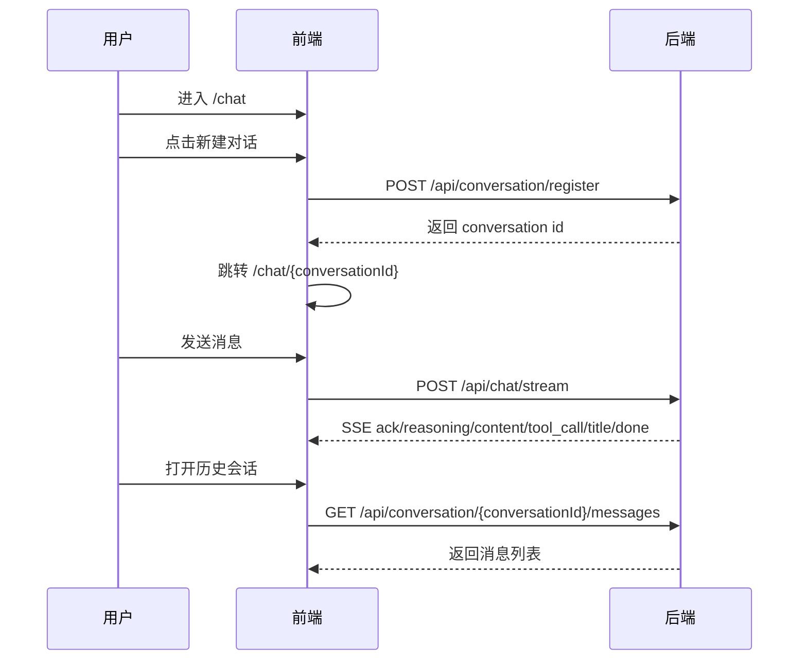

# AI 助手会话交互说明（当前实现）

本文档描述前端会话相关的路由、状态与接口对接，按当前 `frontend/src` 与后端 `/api/conversation/*`、`/api/chat/stream` 实现整理。

## 1. 路由

当前前端路由：

- `/`：重定向到 `/chat`
- `/chat`：欢迎页（空聊天页）
- `/chat/:conversationId`：具体会话页
- `/login`、`/login/wechat/callback`：登录相关页面
- `/markdown`：Markdown 示例页

## 2. 会话接口映射

前端在 `src/services/conversation.ts` 中统一调用以下接口（通过 `apiClient`，最终前缀为 `/api`）：

- 创建会话：`POST /api/conversation/register`
- 会话列表：`GET /api/conversation/list`
- 会话详情：`GET /api/conversation/detail/{conversationId}`
- 更新会话：`PUT /api/conversation/update/{conversationId}`
- 删除会话：`DELETE /api/conversation/delete/{conversationId}`

消息与流式接口在 `src/services/chat.ts`：

- 会话消息：`GET /api/conversation/{conversationId}/messages`
- 删除消息：`DELETE /api/message/delete/{messageId}`
- 流式聊天：`POST /api/chat/stream`（SSE）

## 3. 典型交互流程

## 4. 鉴权与错误处理

- 受保护接口请求需带 `Authorization: Bearer <token>`；
- token 由登录接口响应头 `x-secret-token-info` 下发并在前端存储；
- 当接口返回 `401`（包括 SSE onopen 阶段），前端清理鉴权信息并跳转登录页。

## 5. 与旧文档差异

- 当前实现不使用 `/conversations` 风格路径，统一为 `/api/conversation/*`；
- 当前文档不再将 ChromaDB、Redis 作为前端会话能力依赖；
- 当前推荐的开发命令统一使用 `vp`（例如 `vp dev`、`vp build`）。
