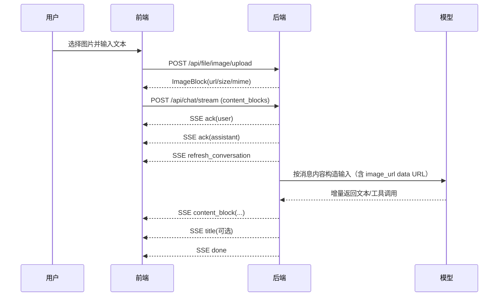

# AI 助手会话与多模态交互说明（当前实现）

本文档聚焦当前前后端真实实现，覆盖会话、流式消息与图片附件链路。代码基线来源：

- 前端：`frontend/src/hooks/chat.ts`、`frontend/src/pages/ChatPage/components/ChatInput/*`
- 后端：`backend/app/api/chat.py`、`backend/app/api/file.py`、`backend/app/utils/multimodal.py`

## 1. 路由

- `/`：重定向到 `/chat`
- `/chat`：欢迎页（创建会话前）
- `/chat/:conversationId`：具体会话页
- `/login`、`/login/wechat/callback`：登录流程
- `/markdown`：Markdown 示例页

## 2. 接口映射（按实现）

### 2.1 会话与消息

- 创建会话：`POST /api/conversation/register`
- 会话列表：`GET /api/conversation/list`
- 会话详情：`GET /api/conversation/detail/{conversationId}`
- 更新会话：`PUT /api/conversation/update/{conversationId}`
- 删除会话：`DELETE /api/conversation/delete/{conversationId}`
- 会话消息：`GET /api/conversation/{conversationId}/messages`
- 删除消息：`DELETE /api/message/delete/{messageId}`
- 流式聊天：`POST /api/chat/stream`（SSE）

### 2.2 图片附件

- 上传聊天图片（需登录）：`POST /api/file/image/upload`
- 预览聊天图片（公开路径）：`GET /api/file/image/preview/{userId}/{filename}`

> 说明：前端附件上传在 `ChatInputSenderHeader` 中通过 `fileAPI.uploadChatImage` 调用，上传成功后把服务端返回的 `ImageBlock` 回填到附件列表。

## 3. 消息结构（content_blocks）

当前聊天请求不再使用单一 `content` 字段，而是使用 `content_blocks`。

### 3.1 用户消息块（当前）

- `text`：文本内容
- `image`：图片附件（`url`、`size`、`mime`）

示例：

```json
{
  "content_blocks": [
    { "id": "cb1", "type": "text", "text": "请描述这张图" },
    {
      "id": "img1",
      "type": "image",
      "url": "/api/file/image/preview/{userId}/{filename}",
      "size": 123456,
      "mime": "image/jpeg"
    }
  ]
}
```

### 3.2 SSE 事件（当前前端处理）

- `ack`：用户/助手消息占位创建
- `refresh_conversation`：刷新侧边栏会话信息
- `title`：异步更新会话标题
- `content_block`：流式内容块事件
- `done`：本轮结束
- `error`：流式错误

`content_block` 的 `data.op` 包括：

- `append`：追加块
- `delta`：文本增量
- `tool_delta`：工具参数增量
- `finalize_round`：结束本轮工具调用阶段
- `done`：content blocks 输出结束

## 4. 端到端流程（文本 + 图片）



## 5. 后端多模态处理要点

1. `ChatRequest.content_blocks` 会先落库，再进入编排流程。  
2. 当用户消息包含 `image` 块时，后端会把预览路径解析为本地文件并转成 `data:image/...;base64,...` 给模型。  
3. 仅标题生成与记忆检索场景，会使用 `extract_user_text_with_image_placeholder`（图片无文本时占位为`[用户发送了图片]`）。  
4. token 估算对 `image_url` 走单独逻辑（按图像尺寸估算 patch token），不是简单按 URL 字符串长度。

## 6. 约束与边界

### 6.1 上传约束

- 后端仅支持：JPEG / PNG / GIF / WebP
- 单图大小上限：10MB（后端校验）
- 图片最长边：1024（后端等比缩放）
- Nginx `client_max_body_size`：50M（网关层限制）

### 6.2 当前前端交互限制

- 发送按钮逻辑目前要求文本非空（`ChatInput.handleSend` 里 `if (!text) return;`）
- 这意味着**纯图片消息在当前 UI 下不会发送**
- 用户消息若包含附件（非 text block）时，不允许走“纯文本编辑”路径

## 7. 鉴权与常见问题排查

### 7.1 鉴权

- 除预览接口外，大部分接口需要 `Authorization: Bearer <token>`
- SSE `onopen` 若返回 `401`，前端会清理 token 并跳转登录页

### 7.2 常见故障

1. **413 Request Entity Too Large**  
   优先检查网关/Nginx `client_max_body_size` 与反向代理链路。

2. **上传返回 400（格式或大小）**  
   核对 MIME 类型与文件大小是否超过 10MB。

3. **图片预览 404**  
   常见于 `userId/filename` 不匹配或文件已不存在；预览路径不应手工拼接。

4. **只有图片无法发送**  
   这是当前前端输入策略导致，非后端能力缺失。

## 8. 与旧文档差异

- 当前实现统一使用 `/api/conversation/*` 与 `/api/chat/stream`
- 聊天请求主体为 `content_blocks`，非旧版 `message/content` 单字段
- 新增并已落地图片附件链路：上传、预览、入模态转换、流式展示
