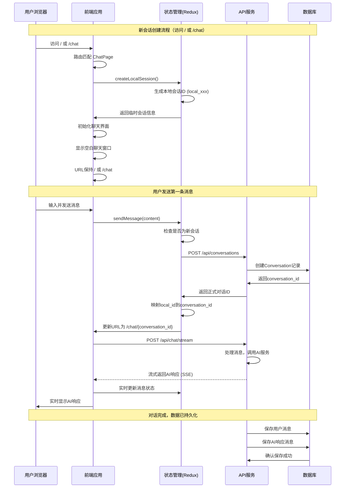
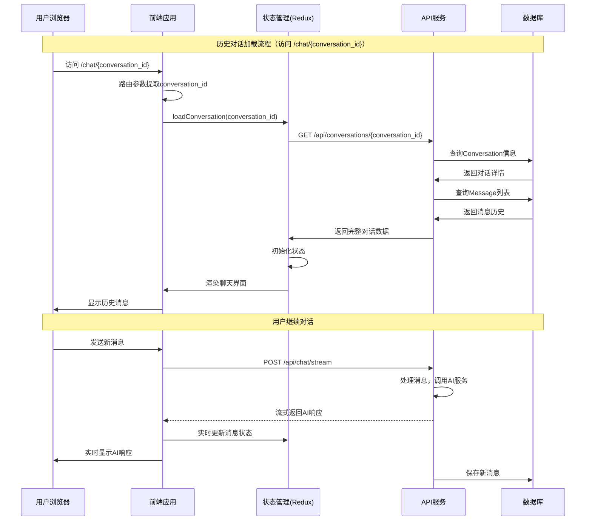
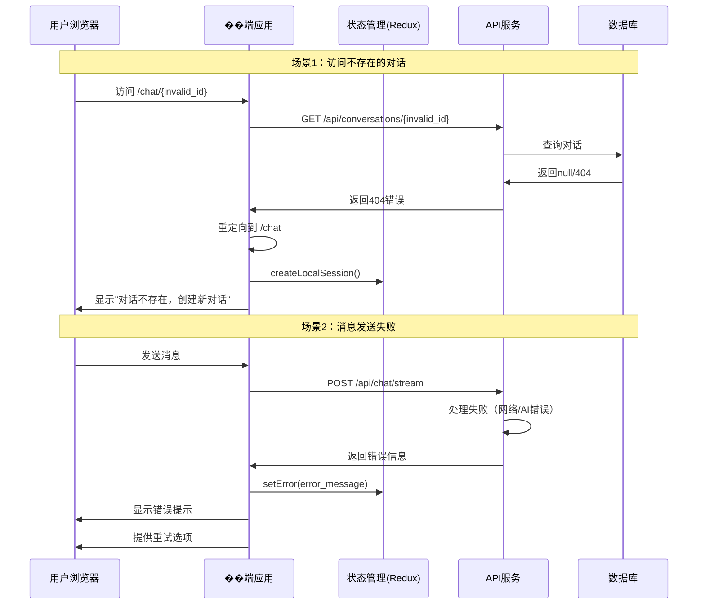

# AI助手会话交互流程设计

## 概述

本文档详细描述了AI助手系统的会话交互流程，包括路由设计、会话管理、数据持久化和用户交互流程。

## 需求描述

### 基本路由功能
1. **默认 URL**: `/` 根路径，前端显示一个新的聊天对话窗口
2. **新对话 URL**: `/chat`，前端显示一个新的聊天对话窗口
3. **历史对话 URL**: `/chat/xxxx`，前端显示一个已经存在的对话历史
4. **动态会话注册**: 对于新的聊天窗口，当用户输入聊天消息后，URL 变为 `/chat/local_xxx`，此时调用服务端接口注册一个对话 id，然后继续 ai 对话
5. **数据持久化**: 服务端返回 ai 响应，并将响应内容保存在数据库

## 系统架构设计

### 1. 路由设计

| URL 路径 | 功能描述 | 状态管理 | 数据持久化 |
|---------|---------|----------|-----------|
| `/` | 根路径，显示新的聊天对话窗口 | 创建临时会话ID | 本地存储 |
| `/chat` | 新的聊天对话窗口 | 创建临时会话ID | 本地存储 |
| `/chat/{conversation_id}` | 显示已存在的对话历史 | 加载指定对话数据 | 数据库加载 |
| `/chat/local_{local_id}` | 新注册的对话窗口 | 本地ID转为正式ID | 持久化到数据库 |

### 2. 会话管理策略

#### 2.1 临时会话创建
- 用户访问 `/` 或 `/chat` 时，前端生成临时会话ID（UUID格式）
- 临时会话ID格式：`local_{timestamp}_{random}`
- 临时状态保存在前端本地存储中

#### 2.2 会话注册机制
- 当用户发送第一条消息时，触发会话注册
- 前端调用 `POST /api/conversations` 创建正式对话记录
- 将本地临时会话ID映射到数据库中的正式conversation_id
- 更新URL为 `/chat/{conversation_id}`

#### 2.3 历史对话加载
- 访问 `/chat/{conversation_id}` 时，先查询数据库验证对话存在性
- 加载对话消息历史和相关元数据
- 初始化前端状态并显示历史消息

### 3. 核心数据模型

#### 3.1 对话模型 (Conversation)
```python
class Conversation(SQLModel, table=True):
    id: str = Field(primary_key=True, index=True)
    title: str                    # 对话标题（自动生成或用户编辑）
    user_id: Optional[str]        # 用户ID（支持匿名访问）
    created_at: datetime
    updated_at: datetime
    message_count: int = 0
    is_active: bool = True
```

#### 3.2 消息模型 (Message)
```python
class Message(SQLModel, table=True):
    id: str = Field(primary_key=True, index=True)
    conversation_id: str = Field(index=True)
    role: str                     # "user" | "assistant" | "system"
    content: str                  # 消息内容
    timestamp: datetime
    reasoning: Optional[str]      # AI��理过程
    tool_calls: Optional[dict]    # 工具调用记录
    message_metadata: dict        # 消息元数据
```

### 4. API接口设计

#### 4.1 会话管理接口

```python
# 创建新对话
POST /api/conversations
{
    "title": "optional_custom_title",
    "user_id": "optional_user_id"
}
Response: {
    "conversation_id": "uuid",
    "title": "generated_or_custom_title",
    "created_at": "timestamp"
}

# 获取对话详情
GET /api/conversations/{conversation_id}
Response: {
    "id": "uuid",
    "title": "string",
    "created_at": "timestamp",
    "message_count": int,
    "messages": [Message]
}

# 获取用户对话列表
GET /api/conversations?user_id={user_id}&limit={limit}&offset={offset}
Response: {
    "conversations": [Conversation],
    "total": int
}

# 更新对话标题
PUT /api/conversations/{conversation_id}
{
    "title": "new_title"
}

# 删除对话
DELETE /api/conversations/{conversation_id}
```

#### 4.2 消息处理接口

```python
# 发送消息并获取AI响应（流式）
POST /api/chat/stream
{
    "conversation_id": "uuid_or_local_id",
    "message": "user_message",
    "model": "deepseek-chat",
    "stream": true
}

# 通过SSE返回流式响应
data: {
    "type": "message" | "reasoning" | "tool_call" | "error",
    "content": "string",
    "metadata": {}
}
```

### 5. 前端状���管理

#### 5.1 Redux状态结构
```typescript
interface ChatState {
  // 基础状态
  messages: ChatMessage[];
  sessionId: string | null;
  isLoading: boolean;
  isStreaming: boolean;
  isReasoning: boolean;
  isCallingTools: boolean;
  error: string | null;

  // 会话管理状态
  conversationId: string | null;     // 正式对话ID
  localSessionId: string | null;     // 临时会话ID
  conversationInfo: {
    id: string;
    title: string;
    created_at: string;
    message_count: number;
  } | null;
  isNewSession: boolean;             // 是否为新会话
  sessionRegistered: boolean;        // 会话是否已注册
}
```

#### 5.2 会话管理Action
```typescript
// 创建临时会话
createLocalSession()

// 注册正式会话
registerConversation(title?: string)

// 加载历史对话
loadConversation(conversationId: string)

// 更新对话信息
updateConversationInfo(conversationId: string, updates: Partial<ConversationInfo>)

// 清除当前会话
clearCurrentSession()
```

## UML时序流程图

### 1. 新会话创建流程



### 2. 历史对话加载流程



### 3. 错误处理流程



## 关键技术实现要点

### 1. 前端路由实现
```typescript
// 路由配置更新
export const routes: RouteConfig[] = [
  {
    path: "/",
    element: <ChatPage />,
    loader: () => redirect("/chat")  // 可选：直接重定向
  },
  {
    path: "/chat",
    element: <ChatPage />,
    loader: () => {
      // 处理新会话���辑
      return { isNewSession: true }
    }
  },
  {
    path: "/chat/:conversationId",
    element: <ChatPage />,
    loader: ({ params }) => {
      // 验证对话ID有效性
      return validateConversation(params.conversationId)
    }
  },
];
```

### 2. 会话ID管理策略
```typescript
class SessionManager {
  private localSessionId: string | null = null;
  private conversationId: string | null = null;

  // 创建本地会话
  createLocalSession(): string {
    this.localSessionId = `local_${Date.now()}_${this.generateRandomId()}`;
    localStorage.setItem('localSessionId', this.localSessionId);
    return this.localSessionId;
  }

  // 注册正式会话
  async registerConversation(title?: string): Promise<string> {
    if (!this.localSessionId) {
      throw new Error('No local session found');
    }

    const response = await api.post('/conversations', { title });
    this.conversationId = response.data.conversation_id;

    // 更新URL
    window.history.replaceState(
      {},
      '',
      `/chat/${this.conversationId}`
    );

    // 清除本地会话ID
    localStorage.removeItem('localSessionId');
    this.localSessionId = null;

    return this.conversationId;
  }
}
```

### 3. 后端中间件增强
```python
# 添加会话验证中间件
async def validate_conversation(request: Request, conversation_id: str):
    """验证对话ID有效性，支持本地会话ID"""
    if conversation_id.startswith("local_"):
        # 允许本地会话ID通过
        return {"is_local": True, "conversation_id": conversation_id}

    # 验证正式对话ID
    conversation = await get_conversation_by_id(conversation_id)
    if not conversation:
        raise HTTPException(status_code=404, detail="Conversation not found")

    return {"is_local": False, "conversation_id": conversation}
```

## 项目技术栈

### 后端技术栈
- **FastAPI**: Python Web 框架
- **SQLModel**: ORM，基于 SQLAlchemy
- **PostgreSQL**: 主数据库
- **ChromaDB**: 向量数据库
- **Redis**: 缓存层
- **OpenAI API**: LLM 调用
- **MCP**: 工具调用协议

### 前端技术栈
- **React 18**: UI 框架
- **TypeScript**: 类型安全
- **Ant Design**: UI 组件库
- **React Router**: 路由管理
- **Redux Toolkit**: 状态管理
- **Axios**: HTTP 客户端
- **fetch-event-source**: SSE 客户端

## 实现优先级

### 高优先级
1. ✅ 数据库模型设计（已完成）
2. ✅ 基础聊天流式接口（已完成）
3. 🔄 会话管理API实现
4. 🔄 前端路由和状态管理重构

### 中优先级
1. 对话列表和搜索功能
2. 对话标题编辑功能
3. 错误处理和用户提示优化
4. 性能优化（消息分页、懒加载）

### 低优先级
1. 对话导出功能
2. 对话分享功能
3. 多用户权限管理
4. 对话统计和分析

---

*文档版本: 1.0*
*最后更新: 2025-11-02*
