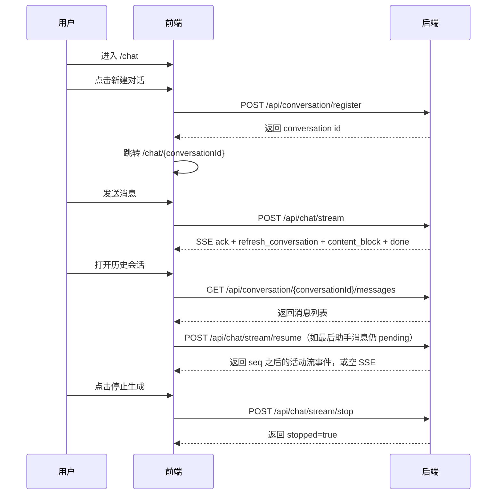

# AI 助手会话交互说明（当前实现）

本文档描述前端会话相关的路由、状态与接口对接，按当前 `frontend/src` 与后端 `/api/conversation/*`、`/api/chat/*` 实现整理。

## 1. 路由

当前前端路由：

- `/`：重定向到 `/chat`
- `/chat`：欢迎页（空聊天页）
- `/chat/:conversationId`：具体会话页
- `/login`、`/login/wechat/callback`：登录相关页面
- `/markdown`：Markdown 示例页

## 2. 会话接口映射

前端在 `src/services/conversation.ts` 中统一调用以下接口（通过 `apiClient`，最终前缀为 `/api`）：

- 创建会话：`POST /api/conversation/register`
- 会话列表：`GET /api/conversation/list`
- 会话详情：`GET /api/conversation/detail/{conversationId}`
- 更新会话：`PUT /api/conversation/update/{conversationId}`
- 删除会话：`DELETE /api/conversation/delete/{conversationId}`

消息与流式接口在 `src/services/chat.ts`：

- 会话消息：`GET /api/conversation/{conversationId}/messages`
- 删除消息：`DELETE /api/message/delete/{messageId}`
- 更新助手消息反馈：`PUT /api/message/feedback/{messageId}`
- 流式聊天：`POST /api/chat/stream`（SSE）
- 断线续流：`POST /api/chat/stream/resume`（SSE）
- 停止流式聊天：`POST /api/chat/stream/stop`
- 模型列表：`GET /api/chat/models`

## 3. SSE 协议与前端处理

### 3.1 后端消息格式

后端使用 `data:` 行返回 JSON（不使用 `event:` 行）：

```text
data: {"type":"ack","data":{...},"seq":1}
```

前端在 `src/services/chat.ts` 中对 `event.data` 做两步处理：

1. `JSON.parse(event.data)`
2. `camelcaseKeys(..., { deep: true })`

因此后端蛇形字段（例如 `updated_at`、`message_metadata`）会变为前端驼峰字段（`updatedAt`、`messageMetadata`）。`seq` 由后端 `StreamRelay` 注入；前端记录最近消费的 `seq`，续流时通过 `Last-Event-ID` 请求头传回后端。

### 3.2 事件类型（按典型时序）

`src/hooks/chat.ts` 中按 `type` 分发的事件如下：

1. `ack`
2. `refresh_conversation`
3. `title`（可选）
4. `content_block`
5. `done`
6. `error`

`content_block.data.op` 承载正文、思考与工具过程，支持：

- `append`
- `delta`
- `tool_delta`
- `finalize_round`
- `done`

历史文档中的 `mcp_tool_call`、`reasoning`、`content` 顶层事件已不是现网协议。

### 3.3 关键约束与坑点

- 前端通过 `type` 分发消息，不依赖 SSE `event` 字段。
- `content_block` 的 `op=done` 只表示内容块流结束；顶层 `done` 才表示本次消息流完成。
- 前端会记录最近消费的 `seq`；页面恢复时若最后一条助手消息仍是 `pending`，会尝试 `POST /api/chat/stream/resume`。
- 续流只对后端进程内仍活动的流有效；生成完成、进程重启或缓冲被移除后，续流接口返回空 SSE。
- 传输错误会由 `fetch-event-source` 自动重试，当前指数退避参数在 `src/services/chat.ts`：最多 `8` 次，最长约 `60s`，基础间隔 `1000ms`。
- 用户点击停止时，前端调用 `POST /api/chat/stream/stop`；后端可能将助手消息保存为 `stopped`，并尽力保留停止前已聚合的内容块。

## 4. 典型交互流程



## 5. 鉴权与错误处理

- 受保护接口请求需带 `Authorization: Bearer <token>`；
- token 由登录接口响应头 `x-secret-token-info` 下发并在前端存储；
- 当接口返回 `401`（包括 SSE `onopen` 阶段），前端清理鉴权信息并跳转登录页。

## 6. 与旧文档差异

- 当前实现不使用 `/conversations` 风格路径，统一为 `/api/conversation/*`；
- 当前实现不再使用 `mcp_tool_call` / `reasoning` / `content` 顶层 SSE 事件，统一使用 `content_block`；
- 当前文档不再将 ChromaDB、Redis 作为前端会话能力依赖；
- 当前推荐的开发命令统一使用 `vp`（例如 `vp dev`、`vp build`）。
