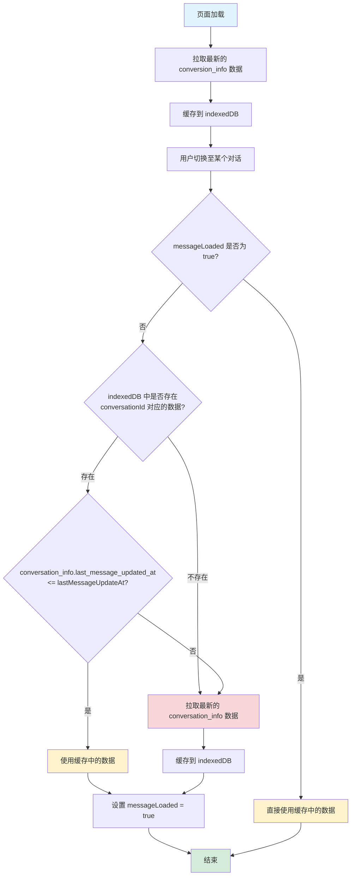

## 对话缓存

### 缓存数据结构

```js
{
  "{conversationId}": {
    messages: [] as ChatMessage[],
    messageLoaded: boolean,
    lastMessageUpdateAt: string, // 等价于 messages.at(-1).updatedAt
    isLoading: boolean,
    isStreaming: boolean,
    isReasoning: boolean,
    isCallingTools: boolean,
  }
}
```


### ChatPage 缓存策略

1. 首先，页面加载时，会拉取最新的 conversion_info 数据，并缓存到 indexedDB 中
2. 然后，用户切换至某个对话时，
  2.1 如果 messageLoaded 为 true，则直接使用缓存中的数据
  2.2 否则，判断 indexDb 中是否存在 conversationId 对应的 conversation_info 数据
    2.2.1 如果存在，并且 conversation_info.last_message_updated_at <= lastMessageUpdateAt，则直接使用缓存中的数据,并设置 messageLoaded 为 true
    2.2.2 否则，拉取最新的 conversation_info 数据，并缓存到 indexedDB 中，并设置 messageLoaded 为 true

对话 last_message_updated_at 时间戳更新时机如下:
- 最后一条消息的 updated_at 时间戳

### 流程图


