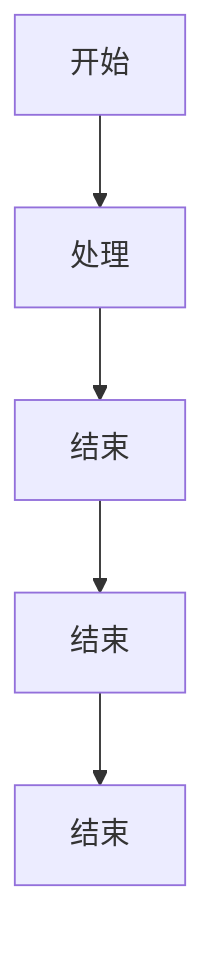
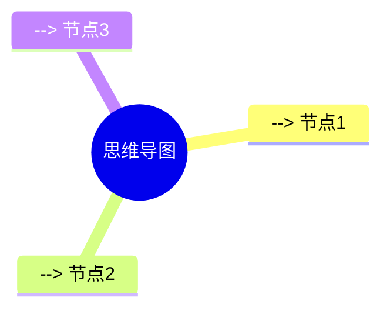

## 二级标题

### 基本语法

- 列表项 1
- 列表项 2
- 列表项 3

> 引用

- [ ] 任务 1
- [x] 任务 2
- [ ] 任务 3

行内代码：`print("Hello, World!")`

### 表格

| 问题 | 可能原因 | 解决办法 | 解决办法 |  解决办法 |
|------|----------|----------|----------|----------|
| 导入后是字符串不是组件 | defaultExport 配置为 url / 版本旧 | 显式加 ?react 或检查插件配置 | 显式加 ?react 或检查插件配置 | 显式加 ?react 或检查插件配置 |
| TypeScript 报错不能找到模块 | 没有声明 d.ts | 添加 svg.d.ts | 添加 svg.d.ts | 添加 svg.d.ts |
| 颜色改不了 | SVG 内部路径硬编码 fill | 用 replaceAttrValues 或手动清理 | 用 replaceAttrValues 或手动清理 |
| 体积大 | 太多重复图标组件 | 动态导入 + icon 模式 + currentColor | 动态导入 + icon 模式 + currentColor | 动态导入 + icon 模式 + currentColor |
| SSR 报 window 未定义 | 其他插件处理了 svg | 确认顺序 / enforce pre | 确认顺序 / enforce pre | 确认顺序 / enforce pre |

### 链接

[链接文本](https://www.baidu.com)

### 图片


### 代码块
```python
# 快速排序
def quick_sort(arr):
    if len(arr) <= 1:
        return arr
    pivot = arr[len(arr) // 2]
    left = [x for x in arr if x < pivot]
    middle = [x for x in arr if x == pivot]
    right = [x for x in arr if x > pivot]
    return quick_sort(left) + middle + quick_sort(right)

print(quick_sort([3, 6, 8, 10, 1, 2, 1]))
```

### 公式

$$
\frac{1}{2\pi i} \oint_C \frac{f(z)}{z-z_0} dz
$$


### 流程图



### 思维导图


