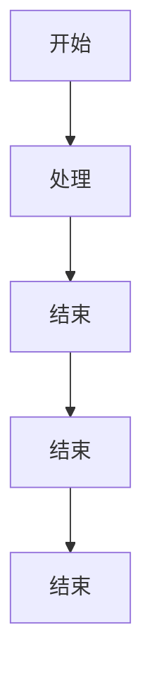
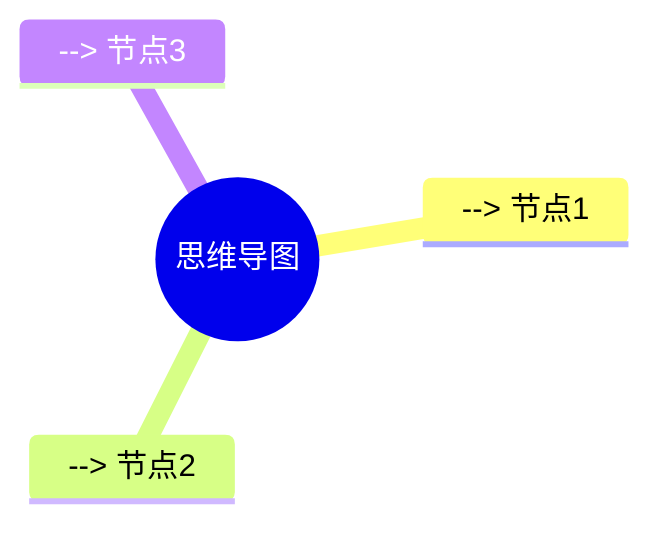

## 二级标题

### 基本语法

- 列表项 1
- 列表项 2
- 列表项 3

> 引用

- [ ] 任务 1
- [x] 任务 2
- [ ] 任务 3

行内代码：`print("Hello, World!")`

### 表格

| 表头 1 | 表头 2 | 表头 3 |
| ------- | ------- | ------- |
| 数据 1 | 数据 2 | 数据 3 |

### 链接

[链接文本](https://www.baidu.com)

### 图片


### 代码块
```python
# 快速排序
def quick_sort(arr):
    if len(arr) <= 1:
        return arr
    pivot = arr[len(arr) // 2]
    left = [x for x in arr if x < pivot]
    middle = [x for x in arr if x == pivot]
    right = [x for x in arr if x > pivot]
    return quick_sort(left) + middle + quick_sort(right)

print(quick_sort([3, 6, 8, 10, 1, 2, 1]))
```

### 公式

$$
\frac{1}{2\pi i} \oint_C \frac{f(z)}{z-z_0} dz
$$


### 流程图



### 思维导图


